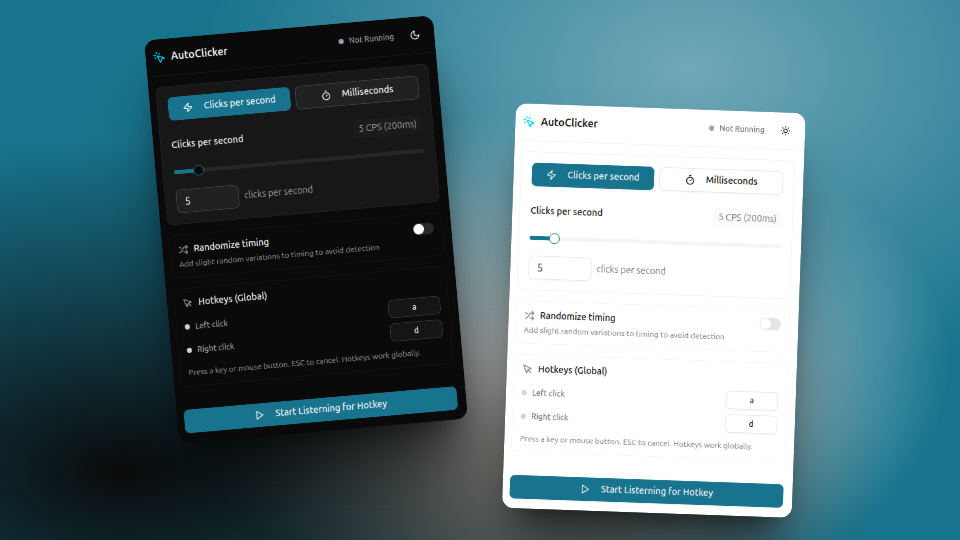

# AutoClicker

> [!NOTE]
> Mouse button hotkeys are currently only supported on Windows. Keyboard hotkeys work on all platforms.

## About

I created this autoclicker because I couldn't find any open-source autoclickers that had all the features I wanted. This project is designed to be simple, powerful, and cross-platform, with a modern UI and essential features.

## Features

- **Hotkeys:** Easily start and stop clicking with customizable keyboard shortcuts.
- **CPS (Clicks Per Second):** Set and monitor your desired click speed.

## Tech Stack

- **Tauri** – Cross-platform desktop app framework
- **Enigo** – Rust library for input simulation
- **Device_Query** – Detecting input events
- **Shadcn** – UI components
- **Tailwind CSS** – Utility-first CSS framework

## Compatibility

- **Windows**
- **Linux** (X11)
- **Mac** (untested)
